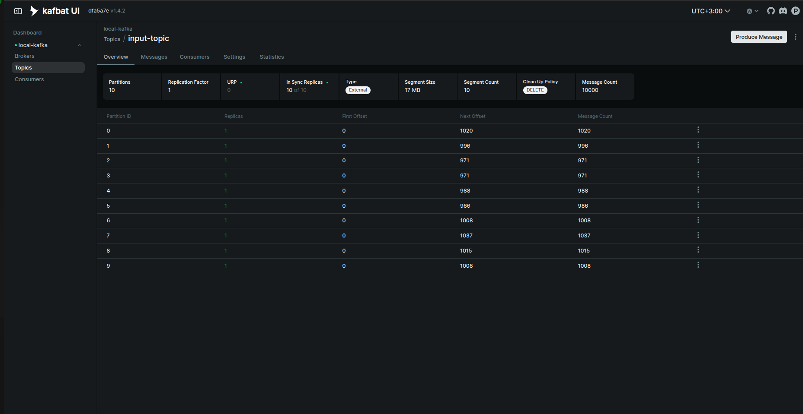

# BigDataFlink

Поднять контейнер: ```docker compose up```  
Дальше остаётся только ждать... Ждать придется долго :)

### Что используется? (библиотеки, фреймворки и пр)
1. userver (c++ фреймворк, который является проодьюсером/примером оч нагруженого сервиса)
2. apache/kafka - брокер сообщений
3. apache/flink
4. postgresql
5. kafka-ui (ui админка для kafka)


